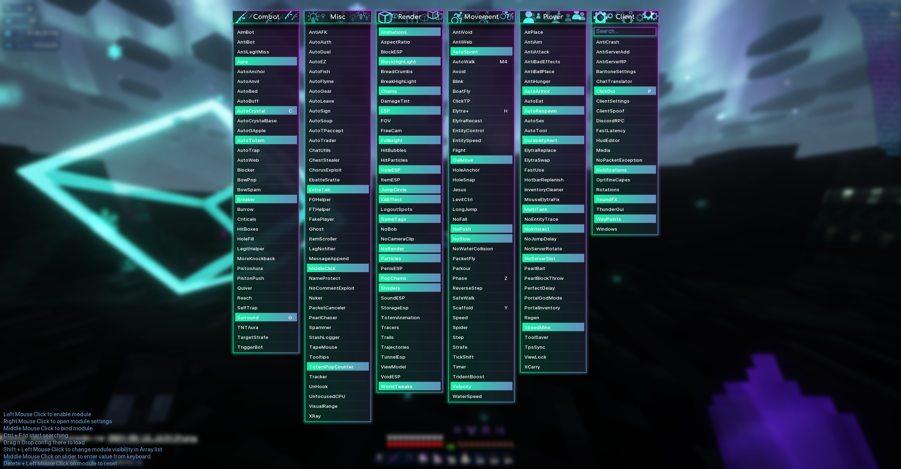
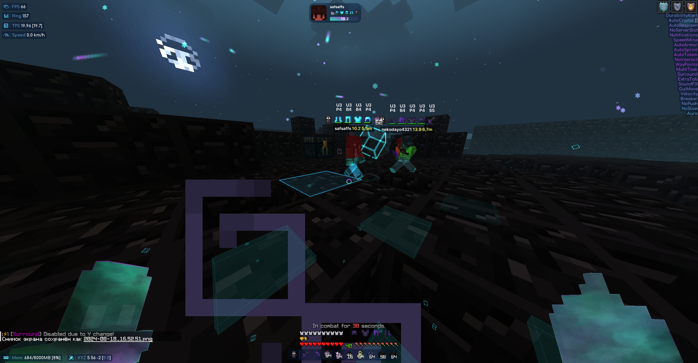
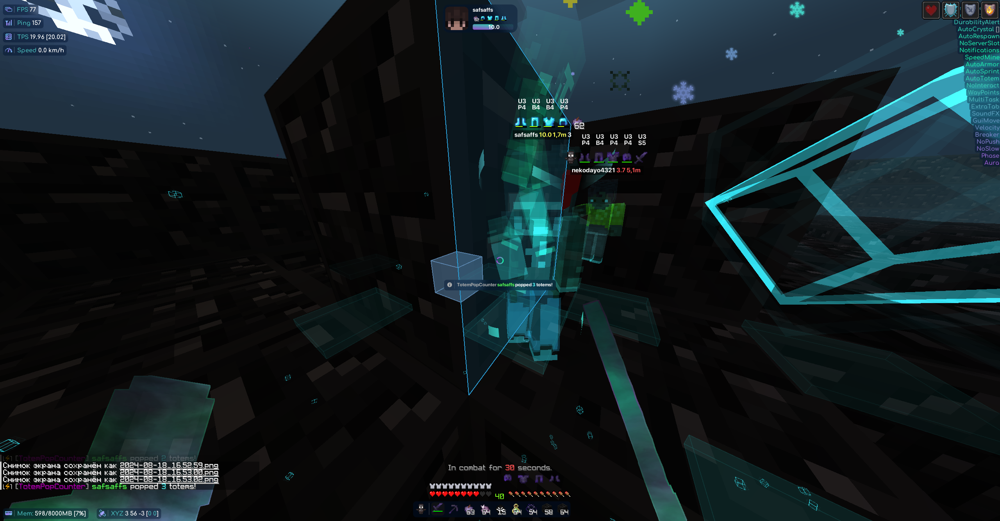
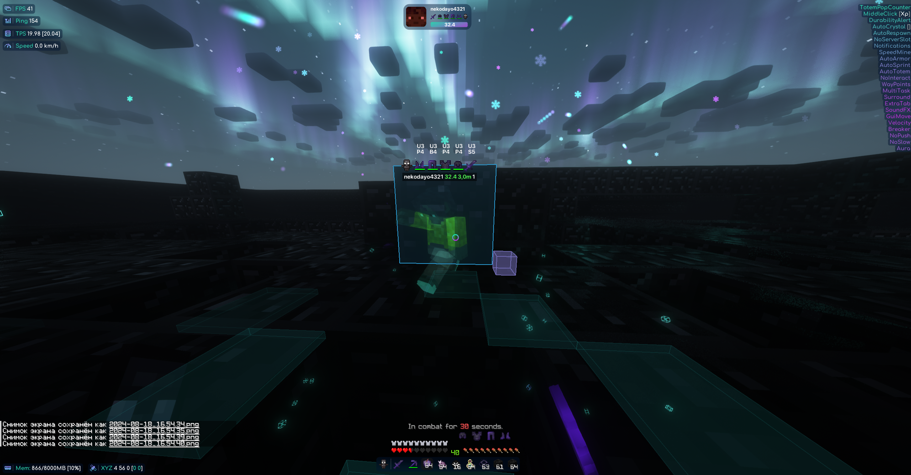

<p align="center">
    
</p>

> [!WARNING]
> Oficial work on ThunderHack Recode is completely stopped, 
> it will be replaced by CatLean, a new free client
> with closed source code and higher quality modules,
> you can follow CatLean in this [Discord server](https://discord.gg/PvBhPWdkVD)

<div align="center">

</div>


<div align="center">

[](https://discord.gg/PvBhPWdkVD)

</div>

# ThunderHack 26.1 Fabric Mod Port

A port of ThunderHack utility mod from Minecraft 1.21 to Minecraft 26.1 Fabric.

<p align="center">
    
</p>

> [!WARNING]
> This is an unofficial port of ThunderHack to MC 26.1 Fabric. Original development by pan4ur has been preserved and API-migrated to work with the latest Fabric mappings.

<div align="center">

</div>

<div align="center">
[](https://discord.gg/PvBhPWdkVD)
</div>

# Information

- Minecraft version: **Fabric 26.1**
- Default ClickGui keybind - **```P```** (verify in-game or on Discord)
- Default prefix - **```@```**
- Middle click the module to bind it.
- This port compiles and launches on Java 25 with Fabric Loom 26.1.

## Requires these mods:

- [FabricApi 26.1](https://www.curseforge.com/minecraft/mc-mods/fabric-api/files/?filter=type:release)
- [Java 25+](https://adoptium.net)

## Recommended to read:

- [Performance guide for Minecraft 1.20.4+ Clients](https://gist.github.com/HexedHero/aab340a84db51913cb1106c2d85f4e4f)
- [Setup guide](https://thunderguidemc.vercel.app/)

## Credits

- [Ai_24](https://www.youtube.com/@Ai_24) for cool showcase
- [KiLAB Gaming](https://www.youtube.com/@KiLABGaming) for complete overview
- [@meteordevelopment](https://github.com/meteordevelopment) for orbit
- [@ladysnake](https://github.com/ladysnake) for satin
- [@0x3C50](https://github.com/0x3C50/Renderer) for the renderer
- [fandyt](https://github.com/paolobonolis-blip) unofficial port coder

## Screenshots

<details>
<summary>GUI</summary>


</details>

<details>
<summary>CRYSTAL HVH</summary>




</details>

<details>
<summary>SWORD HVH</summary>


</details>

## Addons

### Resources

- [Addon Template](https://github.com/cvs0/ThunderHack-Recode-Addon-Template) by cvs0
- [ThunderHack Addon Docs](https://github.com/paolobonolis-blip/ThunderHack-Addon-Docs)
</details>
